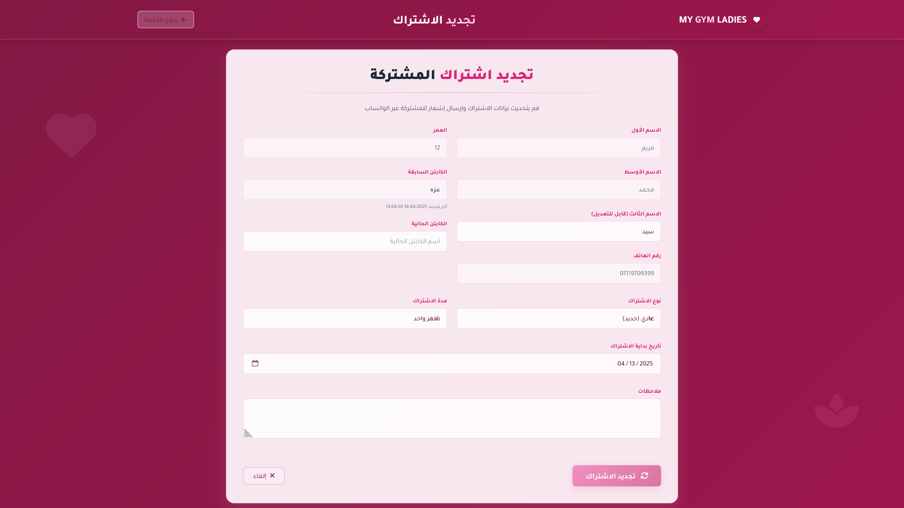

# MyGym Management System 🏋️‍♂️
by **0xmaro**, Cybersecurity Engineer

---

##  Project Overview

**MyGym** is a simple gym management system built using PHP and MySQL. It allows gym administrators to manage members, sessions, and coaches through an easy-to-use web interface.

This project was created for learning and demonstration purposes, and includes features like:
- Adding and renewing gym members
- Managing sessions and schedules
- Coach assignment
- Basic authentication and admin panel

---

##  Screenshots

  
**1**

  
**2**

  
**3**

  
**4**

  
**5**

  
**6**

  
**7**

  
**8**

  
**9**

  
**10**

  
**11**

  
**12**

  
**13**

---

## 🗄️ Database

The database structure is provided in the file `Dumpmygym.sql`.

You can import this SQL file using phpMyAdmin or MySQL CLI to set up the system's backend.

---

##  Project Structure

- `index.php`: Main landing page
- `add_member.php`, `renew.php`, `coach.php`, etc.: Core pages for handling gym operations
- `mygym/`: Refactored and improved backend code
- `screenshots/`: All screenshots shown above
- `Dumpmygym.sql`: Database file

---

##  Author

- **0xmaro**  
- Cybersecurity Engineer
